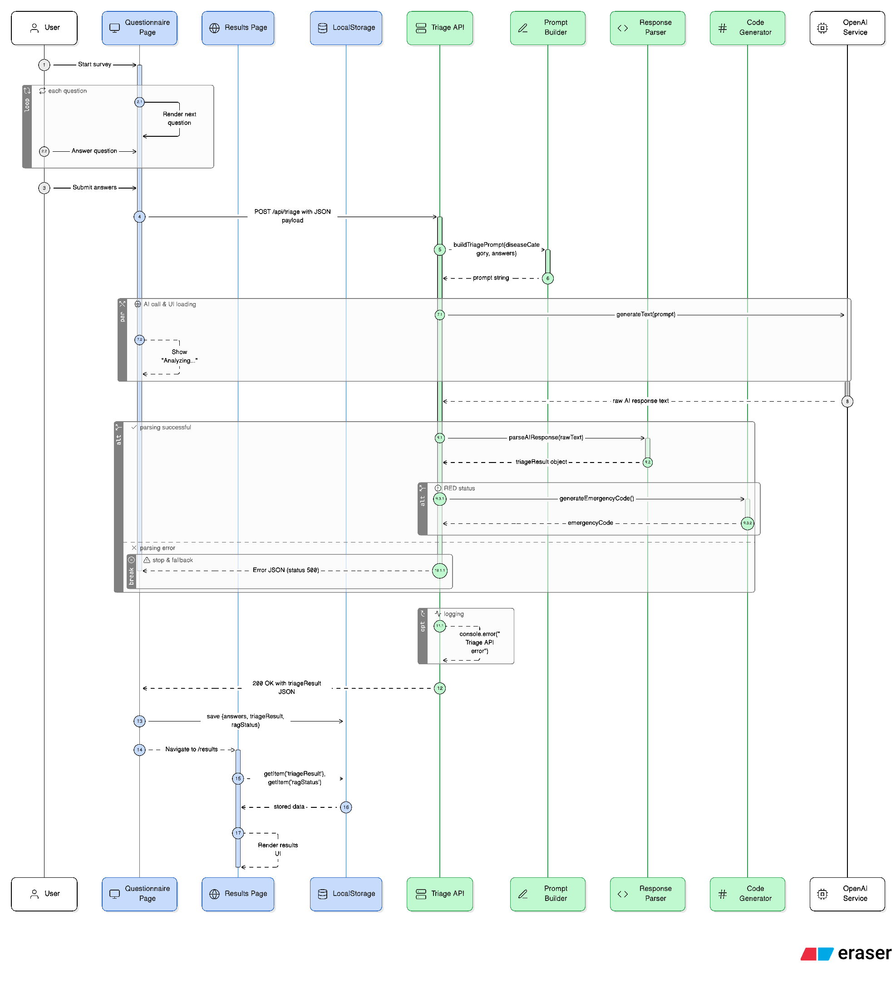

# illness-ai
AI Powered Diagnostic Assistant

## Overview

A **Personal Healthcare Assistant** web application designed to guide users through structured health checkups for 10 common diseases. This is a patient triage tool that collects symptom data, routes users through disease-specific question flows, and classifies outcomes using a RAG system (Red-Amber-Green).

**⚠️ Important:** This tool does NOT provide medical diagnoses - it is a triage system only.

## Architecture Flow



The diagram above illustrates the complete user journey from initial questionnaire through the AI-powered triage system to final outcome and emergency code generation.

## How It Works

### 1. Disease Categories
Users select from 10 disease categories:
- Chest Pain / Heart Concerns
- High Blood Pressure
- Breathing Problems
- Stomach & Bowel Symptoms
- Headache & Neurology
- Mood, Anxiety & Sleep
- Back, Joint & Muscle Pain
- Skin & Moles
- Urinary & Kidney
- Diabetes & Blood Sugar

### 2. SOCRATES Framework
Users answer an 11-step questionnaire covering:
- **S**ite: Where is the problem?
- **O**nset: When did it start?
- **C**haracter: What does it feel like?
- **R**adiation: Does it spread?
- **A**ssociations: Any other symptoms?
- **T**iming: Pattern/duration?
- **E**xacerbating/Relieving: What makes it better/worse?
- **S**everity: How bad is it?

### 3. ICE Integration
- **I**deas: What do you think is causing this?
- **C**oncerns: What worries you most?
- **E**xpectations: What are you hoping for?

### 4. AI-Driven Clarifiers
Up to 10 additional questions based on red flags identified in initial responses.

### 5. RAG Triage System
Outcomes classified into three categories:

- **🟢 GREEN**: Everything looks good
  - Lifestyle advice provided
  - 12-hour SMS follow-up check
  - If symptoms persist → escalate to AMBER/RED

- **🟡 AMBER**: Moderate concern
  - "Call NHS 111" or "Book GP appointment soon"

- **🔴 RED**: Emergency
  - "Call 999 immediately"
  - Unique consultation code generated (e.g., ABC123)
  - Full summary available at `/emergency/[code]`

## Emergency Code System

For RED outcomes:
- Generates unique alphanumeric code
- User shares code with emergency services
- Clinicians access full consultation summary at `/emergency/[code]`
- Summary includes: timestamp, symptoms, severity, red flags, RAG outcome

## Tech Stack

- **Framework:** Next.js (App Router)
- **Frontend:** React components
- **Backend:** Next.js API routes
- **Database:** PostgreSQL
- **SMS:** Twilio
- **Hosting:** Vercel
- **AI:** OpenAI API

## Development Phases

### Phase 1 (MVP)
- ✅ 5 disease buttons
- ✅ Static RAG rules
- ✅ Emergency code system

### Phase 2 (Current)
- 🚧 All 10 disease buttons
- 🚧 API clarifiers
- 🚧 SMS follow-up for GREEN outcomes

### Phase 3 (Future)
- ⏳ Multi-language support
- ⏳ AI-driven triage refinement
- ⏳ NHS/Telehealth integration
- ⏳ Media uploads (skin photos)
- ⏳ AHPF standardization (see below)

## Getting Started

```bash
# Install dependencies
npm install

# Run development server
npm run dev

# Build for production
npm run build

# Start production server
npm run start
```

Open [http://localhost:3000](http://localhost:3000) to view the application.

## Safety & Compliance

- **Safety-first logic:** Defaults to AMBER/RED when uncertain
- **Conservative thresholds:** Prioritises user safety
- **WCAG 2.1 AA compliant:** Accessible design
- **GDPR compliant:** Anonymised data, encrypted storage
- **HTTPS only:** Secure communication
- **Audit logging:** Emergency page access tracked

## Project Structure

```
illness-ai/
├── src/
│   ├── app/                          # Next.js App Router pages
│   │   ├── page.tsx                  # Landing page (disease category selection)
│   │   ├── questions/
│   │   │   └── [slug]/page.tsx       # Dynamic questionnaire pages (SOCRATES)
│   │   ├── results/page.tsx          # RAG triage results (RED/AMBER/GREEN)
│   │   ├── emergency/
│   │   │   └── [code]/page.tsx       # Emergency code access for clinicians
│   │   ├── debug/page.tsx            # Debug/testing page
│   │   └── api/
│   │       └── triage/route.ts       # Triage API endpoint (RAG classification)
│   ├── components/                   # React components
│   ├── lib/                          # Utility functions
│   └── types/                        # TypeScript type definitions
├── assets/                           # Diagrams and documentation
├── node_modules/                     # Dependencies
├── CLAUDE.md                         # AI assistant instructions
├── package.json                      # Project dependencies
├── tsconfig.json                     # TypeScript configuration
├── tailwind.config.ts                # Tailwind CSS configuration
└── README.md                         # This file
```

## AI Health Prompt Framework (AHPF)

Currently, **no industry standard exists** for structuring diagnostic prompts to AI models. This project implements a comprehensive 10-question approach based on the SOCRATES framework, but we recognise the need for standardisation across the healthcare AI community.

### Our Vision: Tiered Prompt Standards

We propose the **Standardised AI Health Diagnostic Prompt Framework (AHPF)** with quality tiers:

- **🥉 Bronze (Basic)**: Minimal data collection
  - Age, gender, primary symptom
  - Quick triage for non-critical cases

- **🥈 Silver (Standard)**: Enhanced context
  - Bronze + medical history
  - Current medications, allergies
  - Symptom duration and severity

- **🥇 Gold (Comprehensive)**: Current implementation
  - Silver + SOCRATES framework (11 questions)
  - ICE integration (Ideas, Concerns, Expectations)
  - Disease-specific clarifiers
  - Red flag detection

- **💎 Platinum (Clinical Grade)**: Future expansion
  - Gold + vital signs (BP, heart rate, temperature, SpO2)
  - BMI and physical metrics
  - Lab results integration
  - Wearable device data
  - Photo/video symptom documentation

### Future Development Plans

We aim to:
1. **Open-source the AHPF specification** for community adoption
2. **Create API standards** for healthcare AI prompt construction
3. **Develop validation tools** to ensure prompt quality
4. **Collaborate with medical institutions** to refine tiers
5. **Publish research** on prompt effectiveness across tiers

**Contributions welcome!** Help us build the future standard for AI-assisted healthcare diagnostics.

## Open Source & Contributing

This project is **open source** and welcomes contributions from the community! We believe in collaborative healthcare technology development and encourage pull requests to add new features, improve existing functionality, and enhance user experience.

### How to Contribute

1. **Fork the repository** and create a feature branch
2. **Make your changes** following our code standards
3. **Test thoroughly** - this is a safety-critical tool
4. **Submit a pull request** with a clear description of your changes

### Contribution Guidelines

This is a safety-critical healthcare tool. All contributions must:
- Follow conservative risk classification thresholds
- Never provide medical diagnoses
- Maintain clear disclaimers
- Preserve emergency code system integrity
- Include appropriate tests
- Follow accessibility standards (WCAG 2.1 AA)

### Ideas for Contributions

- Add support for new disease categories
- Improve question flow UX/UI
- Enhance RAG triage logic
- Add multi-language support
- Implement additional follow-up mechanisms
- Improve accessibility features
- Write documentation and guides

We review all pull requests and appreciate your help in making healthcare more accessible!

## License

This project is licensed under the Apache License 2.0 - see the [LICENSE](LICENSE) file for details.
